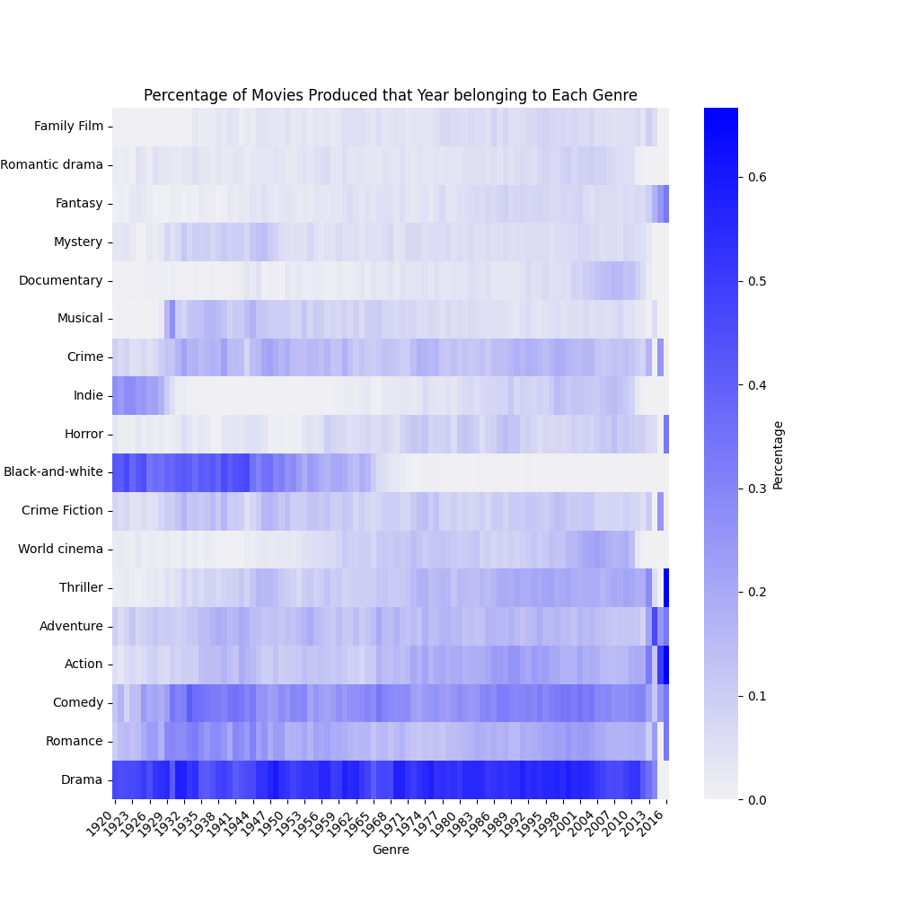
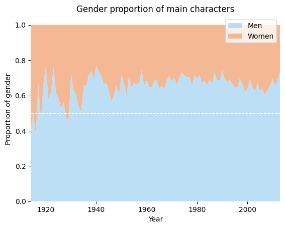
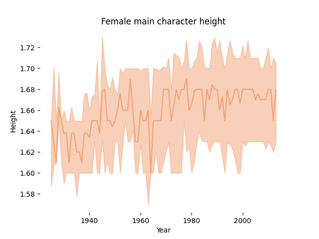
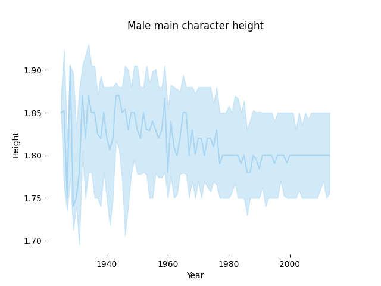
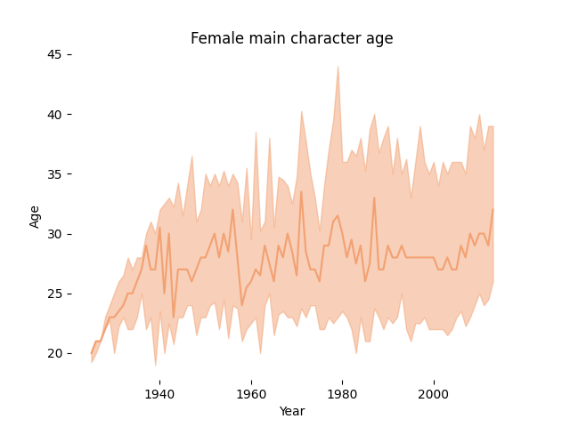
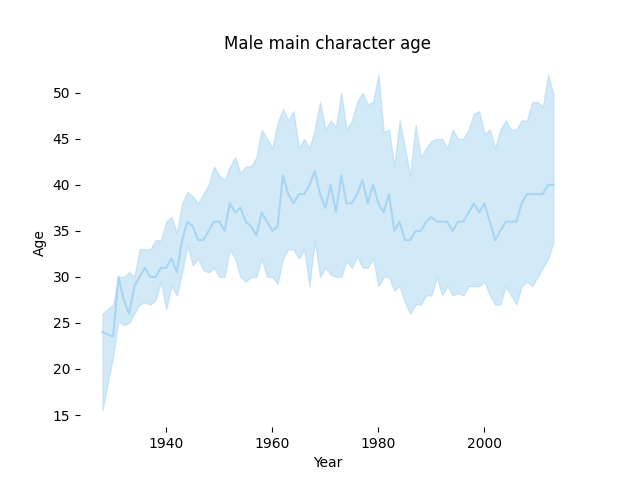
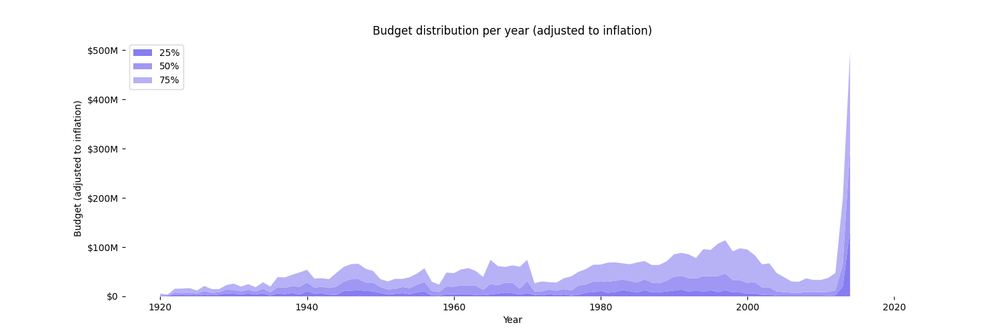
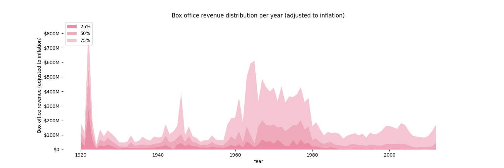

Website https://malena-duck.github.io/success_movie/
# 
 Motivation 

&nbsp;&nbsp;&nbsp;&nbsp;&nbsp;&nbsp;&nbsp;&nbsp;&nbsp;&nbsp;&nbsp;&nbsp;How can we produce a successful movie? _The script? The plot? The genre? Luck?_ And how has that changed over time? In this project we want to see how the movie characteristics have evolved over time. For instance, we will look at the main character, who are they? What is their gender? Age? Do those characteristics influence the success of the film? We will also look at other factors such as genre and runtime. Furthermore, the goal of this project is to discover correlations between the characteristics and success. For instance, what does the main character need to look like when it’s a romantic film vs an adventure film in order to perform well in the box-office? 
&nbsp;  

# 
 Research Questions 

1. How has the production of movies changed over time? What kind of features (genre, runtime, main character gender, etc) were in produced movies?
2. How have those features impacted the box office over time?
3. How well can we correlate production and success?
4. Using these insights, can we predict future production and/or the future box office of arbitrary productions?

# 
 The Data 

&nbsp;&nbsp;&nbsp;&nbsp;&nbsp;&nbsp;&nbsp;&nbsp;&nbsp;&nbsp;&nbsp;&nbsp; We built our dataset from [CMU movies summary dataset](http://www.cs.cmu.edu/~ark/personas/), which contains diverse informations about the movies such as box office revenue, genre, release date, runtime, character descriptions, actors and synopsis. We completed this dataset using **Cinemagoer**, a python package for retrieving and managing the data of the **IMDb movie database**. This package was used to gain more complete information about the characters, the budget, box office, etc... We matched the IMDb movies to the Wikipedia ones using the titles of the movies and release date.

So now let's have a look at our dataset.

## 
 The Evolution of the Production of Movies 

  

### 
 Movie production evolution 

The dataset focuses on movies released before 2015. The increase in movie production in the last 30 years is also consistent with the global trend. With the boom in the number of movies made we have to wonder how the trends have changed throughout the years.

## 
 What Film Industry Are We Analyzing 

### 
 Countries in dataset 

The movies contained in this dataset are overwhelmingly from the United States, followed by some from India and the U.K. Thus, the trends we find will reflect mainly the production of American movies. 

**
 So big Hollywood producers, make sure you pay extra close attention. 
**

  

&nbsp;  
&nbsp;  

## 
 Distribution of Movie Genres 

  

**And Drama takes the spotlight!!! Shocker!**
We can see above drama is the dominating genre in this dataset, followed by comedy and romance. Stay tuned to see if a Drama movie is actually the most profitable.

## 
 Character Archetypes in dataset 

### 
 Character Archetypes 

# 
 The Production of Movies throughout the Ages 

 Let's examine some features in films and how they have evolved. 
 
&nbsp; 
## 
 Runtimes 

&nbsp;&nbsp;&nbsp;&nbsp;&nbsp;&nbsp;&nbsp;&nbsp;&nbsp;&nbsp;&nbsp;&nbsp;We know that at the beginning of the 20th century, in the early days of Cinema, films were short in runtime due to technological limitations. However by the 1920s, technology had advanced enough to accomodate feature-length films. The sky became the limit when it came to runtimes. So what length did directors and producers gravitate towards?

  

&nbsp;&nbsp;&nbsp;&nbsp;&nbsp;&nbsp;&nbsp;&nbsp;&nbsp;&nbsp;&nbsp;&nbsp;Around the 1915s we can see there was variation in runtime duration with a few ups and downs ocsillating around 60 minutes. As time went on however we can see a steadily increase in film duration until the 1960s where the median duration of films plateaued around 100 minutes and has remained there ever since. Take note that the 25th and 75th quantiles (blue area) also plateaued with the median. 

So nowadays movies have little variation in their runtime, but can we be sure it is the right one?

## 
 Genres Production 

  

&nbsp;&nbsp;&nbsp;&nbsp;&nbsp;&nbsp;&nbsp;&nbsp;&nbsp;&nbsp;&nbsp;&nbsp; The popularity of producing black and whites died off as the years went by which is not surprising. We can also see that drama has been the most produced genre each year consistently. At least that was the case until recently! Since 2012 there has been a rise in popularity in other genres such as fantasy, horror, adventure, with thriller and adventure dominating the production. The sudden change in trend from consistently having drama as number one to a range of different genres becoming popular and vastly varying from year to year is quite interesting, this could perhaps be attributed to the shift that Marvel movies brought to the Cinema industry.

## 
 Main Character 

&nbsp;&nbsp;&nbsp;&nbsp;&nbsp;&nbsp;&nbsp;&nbsp;&nbsp;&nbsp;&nbsp;&nbsp;Who is the main character? How have they changed through time? 
&nbsp;

Let's first have a look at the proportions of male vs female main characters:

  

Men are more often the main character than women, though this was not always the case in the early 1920s as seen in the figure above. We can see that the percentage of male leads has increased over time and then oscillated around a maxima.

  
  

  
  

&nbsp;&nbsp;&nbsp;&nbsp;&nbsp;&nbsp;&nbsp;&nbsp;&nbsp;&nbsp;&nbsp;&nbsp;Our analysis of who is the main character gave us the following information:
It seems that for women the main character's height preference has been between 1.6m and 1.72m throughout the years, while for men it seems the interval has decreased with time. From 1.75m to 1.9m before the 1940s to the chosen height being between 1.75m and 1.85m. When it comes to women, we can see that the age rarely exceeds 40 years old. It seems women between the ages of 25 and 30 have usually been the chosen main characters. However, this is not the case for men. Men have a larger, not to mention older, interval between the ages of 30 and 50 years old. Both male and female main characters used to be younger before the 1940s.

# 
 An Analysis of various features' impact on the Box-office throughout Time  

  

We can see that the budget of films has been steadily rising until recent years when it suddenly skyrocketed! This sudden change also matches the timeline for when Drama was dethroned from its number 1 spot as most produced genre each year. In recent years, big budget blockbuster movies have become more popular, such as the Marvel movie franchise. This can explain the explosive increase in budget in such a short amount of time.

  

We can see that the box office actually had a few peaks in the past, with a very prominent one before the 1920s. We can see a steady period where the budget was higher between the 1960s and 1980s before it decreased again and remain flat until present day. Interestingly enough though the budget has dramatically increase in the last few years, this does not seem to be the case for the box office.

# 
 Correlating Production/Features and Success in the Last 30 Years 

&nbsp;   

## 
 Causality Analysis for the Time Series 

Can the trends among certain features indicate how the median of the box office is going to perform? For example, will a sudden increase in the production of Romantic movies indicate an increase in the box office? In order to perform a causality analysis in the time series we have, we will perform a Granger causality test. The Granger causality test is a statistical hypothesis test for determining whether one time series is useful in forecasting another. In our case will a certain feature be useful in forecasting boc office?

&nbsp; 
Let's take a look at the different genres that passed the p-test (0.05) (indicator of how confident we are in the results):

| Genre       | Correlation Coefficient |   Lag (years) |  
| :---------: | :---------:             |      :---------:                  |
| Adventure   | 20.94                      |         9              |
| Indie       | 20.48                     |        3               |
| Documentary | 20.23                    |        10               |
| Thriller    | 19.62                     |      10                 |
| Fantasy     | 16.98                     |     4                  |
| Romantic drama | 16.36                  |    8                   |
| Black-and-white | 12.20                   |   3                    |
| Comedy      | 11.64                      | 3                      |
| Romance     | 10.2                       |  1                     |

We can see that the production of adventure, indie and documentary film have the most causality on the box office. Adventure has a 9 year lag on its effect on the box office though it has the most influence. Romance movies have the shortest lag, with it being only one year, but they do not correlate as strongly as the other genres.
&nbsp; 

How about the main character time series?
The changes in height and age of the main character for both men and women have a correlation with the changes in the box office, with a lag around 9 years. This means that how the main character varies throughout the years can help forecast box office.

## 
 Causality Analysis for Success 

To see how strongly correlated production features are with success we will be using the Pearson correlation coefficient, which measures the linear correlation between two datasets. For this part we will also be looking at the correlation with IMDb ratings. We have all heard of the public indignations when movies were praised for the excellence while wildly underperforming in the box office. So let's have a look whether these features correlate. 

The following table shows the features that have a correlation with Box Office success and/or IMDb rating

| Feature      | IMDb correlation coefficient| Box Office correlation coefficient   | 
| :---        |    :----:   |          ---: |
| Runtime      | yes  0.39       | yes 0.26   |
| Male main character (m.c.)   | yes 0.05        | yes 0.08      |
| Female main character      | yes -0.06       | yes -0.09   |
| Male m.c. height   | yes 0.05        | yes 0.07     |
| Female m.c. height   | yes -0.07        | yes -0.11      |
| Male m.c. age   | yes 0.07       | yes 0.07      |
| Female m.c. age   | yes -0.04        | yes -0.08      |

From the table above we learn that runtimes has a positive correlation with both the box office and thr IMDb, which explains the sudden increase in runtime we have seen in recent years. It must be working. Male main characters also have a positive correlation with both box office and IMDb as well as height and age! This seems to follow the trends we have seen in the section above. However in the case of female main characters there is a negative correlation! The height and age of female characters also has a negative correlation with box office. It seems that perhaps the vestiges of the patriarchy remain in the movie making industry, where women cannot be old and need to be small and cute.

&nbsp;
We looked for the top 5 genres with the strongest correlation (positive or negative) to box office as well as the coefficient of correlation for Drama since that is the most produced type by directors. Here they are in the following table:

| Genre       | Box Office correlation coefficient| IMDb correlation coefficient   |
| :---------: | :---------:             |      :---------:                  |
| Adventure   | 0.26                      |         -0.05             |
| Action       | 0.18                     |        -0.10               |
| Indie | -0.16                    |        0.09            |
| Family film   | 0.15                     |         -0.07              |
| Fantasy       | 0.16                    |        -0.07               |
| Drama | -0.10                    |        0.33              |

So here you have it movie producers, I hope you were paying attentions! Though drama has been the genre most produced it has a NEGATIVE correlation with the box office, though the ratings are positively correlated on the bright side. If you want to make money, drama might not be the way to go. Instead a good action film might do the trick with the box office, as it has the heighest correlation. Though you might get a fair share of negative reviews on IMDb. The increase in production of action and adventure films the last few years, that we mentioned before seems to concord with the results found in the table above.

&nbsp;
## 
 Regression 

&nbsp;&nbsp;&nbsp;&nbsp;&nbsp;&nbsp;&nbsp;&nbsp;&nbsp;&nbsp;&nbsp;&nbsp;In order to try and guess future box office success for movies, we created a linear regression with the following features: budget, runtime, gender main character, age of main character, height of main character and the 20 most popular genres. Unfortunately the regression was not successful in its prediction so we are unable to estimate box office with the use of multiple features and their effect.

# 
 Conclusion 

It seems that the success of a film cannot be easily determined through an algorithm. People are unpredictable and so are movies. It is hard to tell what will speak to the public and entice their hearts. Isn't that part of the beauty though? That writers and directors will have to keep innovating because there is no magic formula? We can however try to have luck on our side sometimes hahaha. It might not guarantee success but it sure does make it more attainable. For that all you will need to have:
- A male main character of height 1.8m and around 40 years old.
- An adventure film genre
- A runtime of around 90 minutes

  

