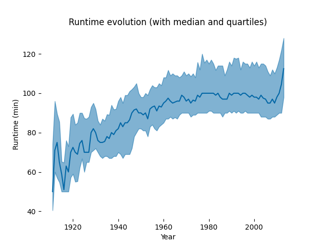

Website https://malena-duck.github.io/success_movie/
# 
 Motivation 

&nbsp;&nbsp;&nbsp;&nbsp;&nbsp;&nbsp;&nbsp;&nbsp;&nbsp;&nbsp;&nbsp;&nbsp;How can we produce a successful movie? _The script? The plot? The genre? Luck?_ And how has that changed over time? In this project we want to see how the movie characteristics have evolved over time. For instance, we will look at the main character, who are they? What is their gender? Age? Do those characteristics influence the success of the film? We will also look at other factors such as genre and runtime. Furthermore, the goal of this project is to discover correlations between the characteristics and success. For instance, what does the main character need to look like when it’s a romantic film vs an adventure film in order to perform well in the box-office? 
&nbsp;  

# 
 Research Questions 

1. How has the production of movies changed over time? What kind of features (genre, runtime, main character gender, etc) were in produced movies?
2. How have those features impacted the box office over time?
3. How well can we correlate production and success?
4. Using these insights, can we predict future production and/or the future box office of arbitrary productions?

# 
 The Data 

&nbsp;&nbsp;&nbsp;&nbsp;&nbsp;&nbsp;&nbsp;&nbsp;&nbsp;&nbsp;&nbsp;&nbsp; We built our dataset from [CMU movies summary dataset](http://www.cs.cmu.edu/~ark/personas/), which contains diverse informations about the movies such as box office revenue, genre, release date, runtime, character descriptions, actors and synopsis. We completed this dataset using **Cinemagoer**, a python package for retrieving and managing the data of the **IMDb movie database**. This package was used to gain more complete information about the characters, the budget, box office, etc... We matched the IMDb movies to the Wikipedia ones using the titles of the movies and release date.

So now let's have a look at what our dataset.

## 
 The Evolution of the Production of Movies 

  

The dataset focuses on movies released before 2015. The increase in movie production in the last 30 years is also consistent with the global. With the boom in the number of movies made we have to wonder how the trends have changed throughout the years.

## 
 What Film Industry Are We Analyzing 

  

The movies contained in this dataset are overwhelmingly from the United States, followed by some from India and the U.K. Thus, the trends we find will reflect mainly the production of American movies. 

**
 So big Hollywood producers, make sure you pay extra close attention. 
**

  

&nbsp;  
&nbsp;  

## 
 Distribution of Movie Genres 

  

**And Drama takes the spotlight!!! Shocker!**
We can see above drama is the dominating genre in this dataset, followed by comedy and romance. Stay tuned to see if a Drama movie is actually the most profitable.

# 
 The Production of Movies throughout the Ages 

 Let's examine some features in films and how they have evolved. 
 
## 
 Runtimes 

&nbsp;&nbsp;&nbsp;&nbsp;&nbsp;&nbsp;&nbsp;&nbsp;&nbsp;&nbsp;&nbsp;&nbsp;We know that at the beginning of the 20th century, in the early days of Cinema, films were short in runtime due to technological limitations. However by the 1920s, technology had advanced enough to accomodate feature-length films. The sky became the limit when it came to runtimes. So what length did directors and producers gravitate towards?

  

(new graph needed ED)
&nbsp;&nbsp;&nbsp;&nbsp;&nbsp;&nbsp;&nbsp;&nbsp;&nbsp;&nbsp;&nbsp;&nbsp;Around the 1915s we can see there was variation in runtime duration with a few ups and downs ocsillating around 60 minutes. As time went on however we can see a steadily increase in film duration until the 1960s where the median duration of films plateaued around 100 minutes and has remained there ever since. Take note that the 25th and 75th quantiles (grey area) also plateaued with the median. 

So nowadays movies have little variation in their runtime, but can we be sure it is the right one?

## 
 Genres Production 

  

  

  

&nbsp;&nbsp;&nbsp;&nbsp;&nbsp;&nbsp;&nbsp;&nbsp;&nbsp;&nbsp;&nbsp;&nbsp;We can see that not only drama has been the most produced genre (has seen in Distribution of Movie Genres above), but that it has dominated the production every year. That is until BLABLA and BLABLA finally managed to defeat the champion.  

